# Taller-Conceptos-Avanzados-JavaScript
# Taller de Fundamentos Avanzados

Este taller está diseñado para aplicar y profundizar en los conceptos avanzados de JavaScript que hemos visto en clase.

## Contenidos

1. [Requisitos](#Requisitos)
2. [Objetivos](#Objetivos)
3. [Instrucciones](#Instrucciones)
4. [Descripción](#Descripción)
   - [Sección 1: Scope y Hoisting](#Sección-1-Scope-y-Hoisting)
   - [Sección 2: Funciones, Closures y Asincronía](#Sección-2-Funciones-Closures-y-Asincronía)
   - [Sección 3: Closures, Promesas y Web APIs](#Sección-3-Closures-Promesas-y-Web-APIs)
   - [Sección 4: Entendiendo el Event Loop](#Sección-4-Entendiendo-el-Event-Loop)
   - [Sección 5: Aplicando Todos los Conceptos - Proyecto de Sistema de Reservas de Hotel](#Sección-5-Aplicando-Todos-los-Conceptos---Proyecto-de-Sistema-de-Reservas-de-Hotel)

## Requisitos

- Conocimiento básico de JavaScript, incluidas variables, funciones y estructuras de control.

## Objetivos

- Entender y aplicar conceptos fundamentales como el scope, hoisting y closures en JavaScript.
- Distinguir entre funciones declaradas y expresadas, comprendiendo su comportamiento en relación con el hoisting.
- Manejar la asincronía utilizando callbacks y promesas.
- Comprender el funcionamiento del event loop y las Web APIs.

## Instrucciones

- Crea un repositorio en GitHub denominado `javascript-6th-workshop`.
- Copia y pega el contenido de este documento en tu `README.md`.
- Sigue las instrucciones detalladas en cada sección para completar los ejercicios.

## Descripcion

### Seccion 1: Scope y Hoisting

**Objetivo:** Comprender y aplicar correctamente los conceptos de scope global, local y de bloque, así como el hoisting en JavaScript.

#### Ejercicio 1: El quiz del Scope.

- Considera el siguiente condigo:

  ```javascript
  // Global Scope
  var globalVariable = "Soy una variable global.";

  function testScope() {
    // Function Scope
    var functionVariable = "Soy una variable local.";

    if (true) {
      // Block Scope
      let blockVariable = "Soy una variable de bloque.";
      console.log("Dentro del bloque:", blockVariable);
    }

    console.log("Dentro de la función:", functionVariable);
  }

  console.log("Fuera de la función:", globalVariable);
  testScope();
  ```

- **Interacción del Usuario:** El script solicitará, a través de un prompt, que el usuario adivine si es posible acceder a cada una de las variables (globalVariable, functionVariable, blockVariable) en diferentes partes del código.

- **Respuesta del Usuario:** Deberás ingresar tus respuestas en el prompt() indicando si crees que el acceso a cada variable es posible y por qué.

- **Validación de Respuestas:** Después de ingresar tus respuestas, el script evaluará y mostrará si cada una de ellas es correcta o incorrecta, y proporcionará una explicación detallada de los resultados.

#### Ejercicio 2: Hoisting en Práctica

- Copia y pega el siguiente código en un archivo de JavaScript o en la consola de tu navegador:

  ```javascript
  // vars call
  console.log("Valor de a:", a);
  console.log("Valor de b:", b);
  console.log("Valor de c:", c);

  // functions call
  console.log("Resultado de funcionDeclarada:", funcionDeclarada());
  console.log("Resultado de funcionExpresada:", funcionExpresada());

  // vars declaration
  var a = 1;
  let b = 2;
  const c = 3;

  // functions declarations
  function funcionDeclarada() {
    return "Función declarada ha sido llamada.";
  }

  const funcionExpresada = function () {
    return "Función expresada ha sido llamada.";
  };
  ```

- Pide al usuario predecir el resultado de cada operación y luego muestra el resultado real para explicar el comportamiento del hoisting. Recuerda que todas las variables y funciones son hoisted, pero con comportamientos diferentes. Por ejemplo, las variables declaradas con var son inicializadas con undefined, mientras que las variables con let y const no pueden ser accedidas antes de su declaración. Con respecto a las funciones, estas son inicializadas con su definición completa, por lo que pueden ser llamadas antes de su declaración.

### Sección 2: Funciones, Closures y Asincronía

**Objetivo:** Explorar la diferencia entre funciones declaradas y expresadas, manejar asincronía mediante el uso de callbacks y promesas, y comprender el funcionamiento del event loop.

#### Ejercicio 3: Closures en Acción

Este ejercicio te permitirá desarrollar un script que demuestra cómo los closures pueden capturar y mantener acceso a variables del scope de una función después de que esta haya terminado de ejecutarse.

- **3.1 Creación de la Función con Closure:**
  - **Definición:** Crea una función llamada `crearSumador()` que acepte un parámetro numérico, el cual será usado dentro del closure. Dentro de `crearSumador()`, define y retorna otra función que acepte un único argumento numérico y lo sume al parámetro original de `crearSumador()`.
- **3.2 Uso de la Función y Observación de Closures:**
  - **Implementación:** Invoca `crearSumador()` con un número específico, por ejemplo, 5. Esto retornará una nueva función, que podrías guardar en una variable, como `sumarCinco`.
  - **Uso:** Utiliza `sumarCinco()` para sumar otro número, digamos 3, y observa el resultado.
- **3.3 Ejecución y Análisis:**
  - **Prueba:** Ejecuta el script y verifica que el resultado sea el esperado, en este caso 8.
  - **Reflexión:** Nota cómo `sumarCinco`, a pesar de ser llamada después de que `crearSumador()` haya completado su ejecución, todavía tiene acceso al valor original con el que fue creada, en este caso, 5.

#### Experimentación Adicional

- **Innovación:** Prueba `crearSumador()` con diferentes valores iniciales y utiliza la función retornada para realizar varias sumas.
- **Observación:** Reflexiona sobre cómo cada instancia de la función creada por `crearSumador()` mantiene su propio entorno cerrado con el valor inicial específico.

#### Preguntas para Reflexión

- ¿Cómo mantienen las funciones su acceso a variables externas después de que la función externa ha terminado de ejecutarse?
CONCEPTO IMPORTANTE: ÁMBITO LÉXICO Y CLOSURE. 
En JavaScript, las funciones pueden mantener su acceso a las variables externas incluso después de que la función externa ha terminado de ejecutarse gracias
a un concepto llamado closure. El closure es una función que recuerda el entorno léxico en el que se creó. Esto significa que una función puede acceder a las variables
de su entorno exterior, incluso después de que la función externa haya terminado de ejecutarse. 

- ¿Cuáles son las implicaciones de memoria de mantener estos closures, especialmente si se crean muchas instancias de funciones con closures?
Los closures en JavaScript pueden tener implicaciones de memoria importantes si no se manejan correctamente, especialmente si se crean instancias de funciones con closures.
Aquí están algunas implicaciones:

*USO INCREMENTADO DE MEMORIA:
Cada closure que se crea mantiene una referencia al entorno léxico en el que fue creada, lo que significa que todas las variables de ese entorno también se mantienen en memoria. Si se crean muchas closures, esto puede llevar a un uso incrementado de memoria ya que cada closure puede potencialmente retener una copia de todas las variables en su alcance exterior.

*POSIBLES FUGAS DE MEMORIA:
Las fugas de memoria ocurren cuando los objetos que ya no son necesarios no son liberados de la memoria. Si una closure mantiene referencias a objetos grandes o a muchos objetos, estos objetos no serán recolectados por el garbage collector hasta que todas las referencias a ellos hayan sido eliminadas. Esto puede ser un problema si no se tiene cuidado al crear closures y no se eliminan adecuadamente cuando ya no son necesarios.

*MAYOR COMPLEJIDAD EN EL DEPURADO
Las fugas de memoria ocurren cuando los objetos que ya no son necesarios no son liberados de la memoria. Si una closure mantiene referencias a objetos grandes o a muchos objetos, estos objetos no serán recolectados por el garbage collector hasta que todas las referencias a ellos hayan sido eliminadas. Esto puede ser un problema si no se tiene cuidado al crear closures y no se eliminan adecuadamente cuando ya no son necesarios.


#### Ejercicio 4: Funciones Declaradas vs Expresadas

- Crearás un pequeño script que intenta llamar a dos funciones, una declarada y otra expresada, antes y después de su declaración. Observarás qué sucede cuando intentas llamar a estas funciones en diferentes puntos de tu código.

  - **4.1: Preparación del Script:** Copia el siguiente código en un archivo de JavaScript o en la consola de tu navegador:

    ```javascript
    console.log(
      "Intentando llamar a 'funcionDeclarada' antes de su declaración:"
    );
    try {
      console.log(funcionDeclarada());
    } catch (error) {
      console.log("Error:", error.message);
    }

    console.log(
      "Intentando llamar a 'funcionExpresada' antes de su declaración:"
    );
    try {
      console.log(funcionExpresada());
    } catch (error) {
      console.log("Error:", error.message);
    }

    // Declaración de una función declarada
    function funcionDeclarada() {    //Una función declarada es una función que se define con la palabra function seguida del nombre de la función
      return "Función declarada ha sido llamada.";
    }

    // Declaración de una función expresada
    const funcionExpresada = function () {
      return "Función expresada ha sido llamada.";
    };

    console.log("Llamando a 'funcionDeclarada' después de su declaración:");
    console.log(funcionDeclarada());

    console.log("Llamando a 'funcionExpresada' después de su declaración:");
    console.log(funcionExpresada());
    ```

  - **4.2: Ejecuta el Script:** Observa los resultados de los intentos de llamar a ambas funciones antes y después de su declaración.

  - **4.3: Reflexión:** Después de ejecutar el código, responde los siguientes puntos:

    - ¿Qué sucedió cuando intentaste llamar a las funciones antes de su declaración?
    Antes de la declaración la funcionDeclarada si fue llamada, pero la funcionExpresada no fue llamada. En consola obtuvimos lo siguiente:
    Error: Cannot access 'funcionExpresada' before initialization. 

    - ¿Cómo difieren los resultados entre la función declarada y la función expresada?
    Una función declarada es una función que se define con la palabra clave function seguida del nombre de la función. Esta definición se eleva(hoisting) al principio del contexto 
    de ejecución, lo que significa que puede ser llamada antes de su declaración en el código. 
    Mientras que, una función expresada es una función que se define dentro de una expresión, como una asignación de variable. Este tipo de función no se eleva(hoisting), lo que
    significa que no se puede llamar antes de su definición en el código. 

    - ¿Qué indica esto sobre cómo el JavaScript maneja estas dos diferentes declaraciones de funciones?
    Las funciones declaradas pueden ser llamadas antes de su definición debido al hoisting. Las funciones expresadas no se elevan por lo que no se pueden llamar
    antes de su definición. 

#### Ejercicio 5: Promesas y Callbacks en Acción

- En este ejercicio, desarrollarás un script que incluye una función. Esta función debe aceptar un callback y trabajar con una promesa. El objetivo es que el callback se ejecute solo después de que la promesa se haya resuelto, permitiendo entender la relación y el flujo entre operaciones síncronas y asíncronas.

  - 5.1: Definir la función: Vamos a definir una función llamada manejarAsincronia. Esta función aceptará dos parámetros: un callback y una promesa. La función deberá asegurarse de que el callback solo se ejecute una vez que la promesa se haya resuelto.
  - 5.2: Crear la Promesa: Dentro de la función, crearás una promesa que se resuelva automáticamente después de 2 segundos. Puedes usar setTimeout dentro del constructor de la promesa para lograr este comportamiento.
  - 5.3: Ejecutar el Callback: Una vez que la promesa se resuelva, debes ejecutar el callback proporcionado. Este callback simplemente mostrará un mensaje en la consola, por ejemplo: "¡Promesa cumplida y callback ejecutado!".
  - 5.4: Invocar la Función: Después de definir la función, deberás invocarla pasando un callback y la promesa que creaste. Observa cómo el callback solo se ejecuta después de que la promesa se resuelve.
  - 5.5: Despues de invocar la funcion, responde las siguientes preguntas:

    -¿Qué sucede si cambias el tiempo de resolución de la promesa a 5 segundos o a 1 segundo?
    El callback tiene que esperar este tiempo(5 segundos 0 1 segundo) a la que promesa se resuelva para poder ejecutarse.

    - ¿Cómo se comporta la función si la promesa es rechazada en lugar de resuelta?
    Como no se consideró que pasaría si la promesa es rechazada, no se tiene ninguna instrucción que ejecute esto. 

    - ¿Puedes modificar la función para que el callback maneje diferentes tipos de información dependiendo del resultado de la promesa?
    Si, adicionando un valor en el resolve de la promesa y haciendolo llegar hasta el callback para manejar el tipo de información que quiero mostrar. 

  Nota\* Si deseas llevar este ejercicio un paso más allá, modifica la función para que también maneje el rechazo de la promesa. En este caso, el callback debería recibir información sobre si la promesa fue resuelta o rechazada, y mostrar un mensaje adecuado en la consola.

#### Ejercicio 6: Event Loop y Web APIs

- En este ejercicio, escribirás un script que utiliza setTimeout() para organizar la ejecución de código en tiempos específicos. Observarás el orden en el que los mensajes se muestran en la consola y reflexionarás sobre el papel del event loop y cómo JavaScript gestiona las operaciones de entrada/salida y las tareas asíncronas.

**Diseño del Experimento** - Vamos a diseñar un simple experimento para ver cómo el event loop maneja las tareas. - Necesitarás utilizar la función setTimeout() para planificar la ejecución de código.

**Implementación del Script:** - Inicia tu script mostrando un mensaje en consola que diga "Mensaje 1: Inmediatamente". - Luego, utiliza setTimeout() con un retardo de 0 segundos para mostrar "Mensaje 2: Con timeout de 0 segundos". - Finalmente, configura otro setTimeout() con un retardo de 1 segundo para mostrar "Mensaje 3: Con timeout de 1 segundo".
**Ejecución y Observación:** - Ejecuta el script en tu entorno de desarrollo o en la consola del navegador. - Observa el orden en el que aparecen los mensajes y toma nota.

**Reflexión y Análisis:** - ¿Por qué "Mensaje 2: Con timeout de 0 segundos" no se muestra inmediatamente después de "Mensaje 1: Inmediatamente", a pesar de tener un retardo de 0 segundos?

Para recordar:
EVENT LOOP: Es un concepto fundamental en JavaScript que permit la ejecución no bloqueante del código, lo que es esencial para manejar operaciones asíncronas. 
JavaScript es un lenguaje de un solo hilo, lo que significa que puede ejecutar una sola operación a la vez. Sin embargo, gracias al event loop, puede manejar múltiples operaciones asíncronas, como las solicitudes de red, temporizadores y eventos de usuario, sin bloquear la ejecución del código.

La razón por la que mensaje 2 no se muestra inmediatamente después de mensaje 1 es que, JavaScript utiliza un event loop para manejar operaciones asíncronas. Las tareas asíncronas, como los callbacks de setTimeout, se colocan en la cola de tareas(task queue) después de que el tiempo especificado haya transcurrido. Aunque setTimeout se llama con un retraso de cero segundos, la ejecución del callback asociado se maneja de manera asíncrona. 

PASO A PASO:

1. Pila de llamadas (Call Stack): La llamada a setTimeout se añade a la pila de llamadas y se ejecuta. La función setTimeout establece un temporizador con un retraso de 0 milisegundos.
2. Web APIs: El temporizador de setTimeout se maneja mediante las Web APIs del navegador. El callback se programa para ser añadido a la cola de tareas una vez que el temporizador expire.
3. Cola de tareas (Task Queue): Después de que el temporizador expire (que es inmediatamente en este caso), el callback se coloca en la cola de tareas.
4. Event Loop: El event loop verifica continuamente si la pila de llamadas está vacía. Si la pila de llamadas está vacía, el event loop toma la primera tarea de la cola de tareas (en este caso, el callback de setTimeout) y la añade a la pila de llamadas para su ejecución.

Sin embargo, el callback no se ejecuta inmediatamente después de que setTimeout se llame, ya que la ejecución del callback depende de cuándo la pila de llamadas esté vacía.

 - ¿Que nos dicen este comportamiento sobre el event loop, las macro y micro tareas, y la forma en que JavaScript maneja las operaciones asíncronas?

 El event loop prioriza la ejecución de tareas en la pila de llamadas (call stack). Las tareas en la cola de tareas se ejecutan solo cuando la pila de llamadas está vacía. Esto significa que aunque setTimeout tenga un retraso de 0 segundos, el callback asociado no se ejecuta inmediatamente después de que se llame setTimeout, sino que espera su turno en la cola de tareas.

 El event loop asegura que las tareas se manejen en el orden adecuado y que las operaciones síncronas y las microtareas se prioricen sobre las macrotareas como setTimeout.
 Aunque setTimeout con un retraso de 0 segundos se ejecuta de manera asíncrona, no garantiza la ejecución inmediata del callback debido a cómo JavaScript gestiona las tareas en la cola de tareas y en la pila de llamadas.

#### Ejercicio 7: Considera el siguiente script:

```javascript
console.log("Inicio del script");

setTimeout(() => {
  console.log("Primer setTimeout");
}, 0);

setTimeout(() => {
  console.log("Segundo setTimeout");
}, 0);

Promise.resolve("Promesa resuelta").then(console.log);

console.log("Fin del script");
```

- Crea un script que muestre al usuario el codigo anterior y le pida predecir el orden en que se mostrarán los mensajes en consola. Con base en la respuesta del usuario, muestra el resultado real (muestra por consola el orden en que se muestran los mensajes) e identifica el error del usuario de la siguiente manera:

  - Si el usuario acertó el orden, muestra un mensaje de felicitaciones.
  - Si el usuario falló en un solo paso, muestra un mensaje de error y explica el paso incorrecto.
  - Si el usuario falló en dos o más pasos, muestra un mensaje de error y explica los pasos incorrectos.

### Seccion 3: Closures, Promesas y web APIs

**Objetivo:** Aplicar closures y entender el funcionamiento de las Web APIs en JavaScript.

#### Ejercicio 8: Magia con Closures

- Implementa un contador utilizando closures que permita incrementar y obtener el valor actual.

- Proporciona una interfaz simple con prompts para que el usuario interactúe con el contador.

- Utiliza un bucle while para preguntar al usuario si desea incrementar el contador o salir. 

#### Ejercicio 9: Domina las Web APIs con Promesas y Fetch

- Crea un script interactivo que utilice setTimeout para ejecutar una acción después de un intervalo pedido al usuario.
- Suponiendo que el usuario ingreso n segundos, el script debe mostrar un mensaje en consola despues de n\*1000 milisegundos.
- Usa promesas para manejar la asincronía y mostrar el mensaje en consola.
- Usa fetch para cargar datos de la siguiente URL: https://jsonplaceholder.typicode.com/posts
- Muestra los datos en consola y maneja cualquier error que pueda ocurrir en el bloque catch de la promesa.

### Seccion 4: Entendiendo el Event Loop a profundidad

**Objetivo:** Comprender el funcionamiento del event loop y las Web APIs en JavaScript con una herramienta de visualización.

#### Ejercicio 10: Visualización del Event Loop

- Considera el siguiente código:

```javascript
console.log("Inicio del script");

// Macrotarea: setTimeout
setTimeout(() => {
  console.log("Macrotarea 1 second (setTimeout)");
}, 1000);

setTimeout(() => {
  console.log("Macrotarea 0 seconds (setTimeout)");
}, 0);

// Microtarea: Promesa
Promise.resolve()
  .then(() => {
    //Macrotarea anidada dentro de una microtarea
    setTimeout(() => {
      console.log("Macrotarea (setTimeout) inside Microtarea 1");
      return "from micro 1";
    }, 0);
  })
  .then((message) => {
    console.log("Microtarea 2 (Promesa)");
  });

// Microtarea: Promesa
Promise.resolve()
  .then(() => {
    console.log("Microtarea 3 (Promesa)");
  })
  .then(() => {
    console.log("Microtarea 4 (Promesa)");
  });

console.log("Fin del script");
```

- Vamos a https://www.jsv9000.app/ y copia y pega el código anterior en la seccion izquierda
- Enseguida presiona el boton verde de RUN y observa el resultado en la seccion derecha
- Después, pulsara el boton verde de Step para ver el orden en que se ejecutan las tareas y observa el resultado en las secciones de task, microtask, callstack y event loop.
- Finalmente, responde las siguientes preguntas:

  - ¿Qué tareas se consideran macrotareas y cuáles son microtareas?

MICROTAREAS:

1. Promise.resolve()
  .then(() => {...})   //Se resuelve, añadiendo una macrotarea y no imprime nada aún. 

2. .then((message) => {
    console.log("Microtarea 2 (Promesa)");
  });

3. Promise.resolve()
  .then(() => {
    console.log("Microtarea 3 (Promesa)");
  })
  .then(() => {
    console.log("Microtarea 4 (Promesa)");
  });

  MACROTAREAS:

1. setTimeout(() => {
      console.log("Macrotarea 0 seconds (setTimeout)");
    }, 0);

2.  setTimeout(() => {
      console.log("Macrotarea (setTimeout) inside Microtarea 1");
      return "from micro 1";
    }, 0);

3. setTimeout(() => {
    console.log("Macrotarea 1 second (setTimeout)");
  }, 1000);

  - ¿Cómo se relacionan las macrotareas y microtareas con el event loop?

Las microtareas son tareas que se colocan en la cola de microtareas y tienen prioridad sobre las macrotareas. 
Se ejecutan justo después del stack de ejecución actual y antes de cualquier macrotarea pendiente. 

Las macrotareas son aquellas tareas que se colocan en la cola de macrotareas. 
Se ejecutan una vez que el stack de ejecución actual esté vacío y todas las microtareas pendientes hayan sido ejecutadas.

El event loop sigue el siguiente proceso:
1. Ejecuta todo el código global inicial.
2. Procesa todas las microtareas pendientes.
3. Luego, procesa la primera macrotarea en la cola de macrotareas.
4. Vueleve a procesar las microtareas pendientes. 
5. Repite este ciclo continuamente. 

  - ¿Qué sucede cuando una microtarea genera una nueva macrotarea dentro de ella?

  Cuando una microtarea genera una nueva macrotarea dentro de ella, esta nueva macrotarea no se ejecuta inmediatamente después de la microtarea. En su lugar, la nueva macrotarea se encola en la cola de macrotareas y se ejecutará en el próximo ciclo del event loop, después de que todas las microtareas actuales se hayan completado y el stack de ejecución esté vacío.

  - ¿Cómo se manejan las promesas y los setTimeout en relación con el event loop?

MANEJO DE setTimeout:
setTimeout añade una función a la cola de macrotareas. Aunque se especifique un retardo de 0 milisegundos, no se ejecutará inmediatamente. Se programará para ser ejecutada después de que el call stack esté vacío y después de que se hayan procesado todas las microtareas actuales.

Manejo de Promesas:
Las promesas utilizan la cola de microtareas. Cuando una promesa se resuelve, su callback .then se encola como una microtarea. Esto significa que las microtareas (promesas) tienen mayor prioridad que las macrotareas (setTimeout).

- Nota\* Para este ejercicio, es necesario adjuntar screenshots de la visualización del event loop en jsv9000.app y responder las preguntas planteadas.

EVALUATE SCRIPT 
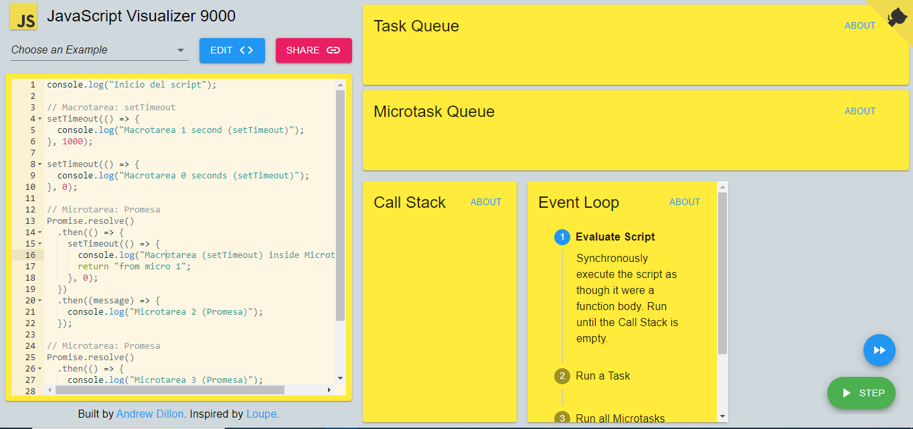

SE EJECUTA UNA TAREA SINCRONA
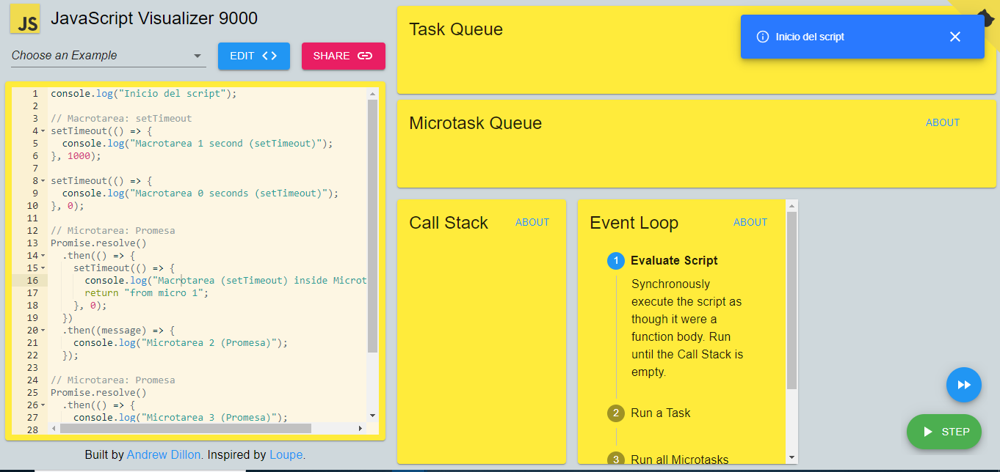

SE ENCOLA LA PRIMERA MACROTAREA
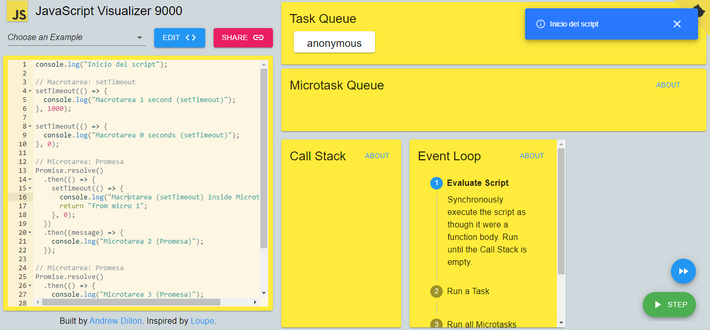

SE ENCOLA LA SEGUNDA MACROTAREA


SE ENCOLA LA PRIMERA MICROTAREA


SE ENCOLA LA SEGUNDA MICROTAREA


ESTAN EN COLA LAS MACROTAREAS Y MICROTAREAS, SE REVUELVE UNA TAREA SINCRONA


UNA MICROTAREA PASA A LA PILA DE LLAMADAS
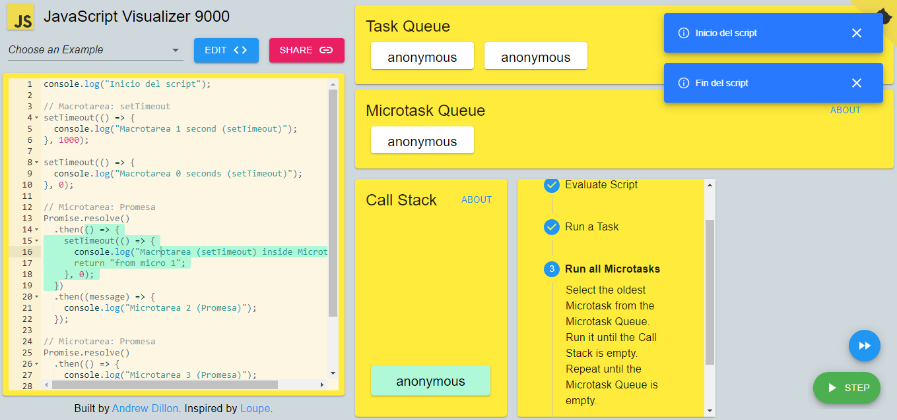

SE ENCOLA OTRA MACROTAREA


SE ELIMINA UNA MICROTAREA DE LA PILA DE LLAMADAS


SE ENCOLA UNA MICROTAREA


UNA MICROTAREA PASA A LA CALL STACK 
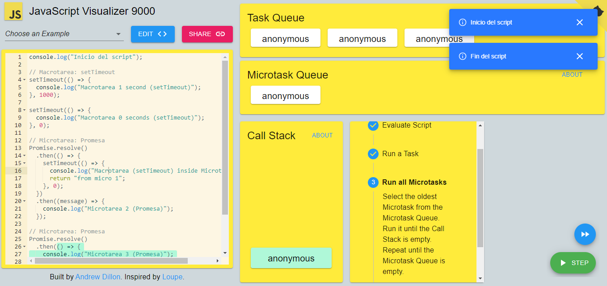

SE RESUELVE LA MICROTAREA 3 (Promesa)


SE ELIMINA UNA MICROTAREA DE LA CALL STACK


SE ENCOLA UNA MICROTAREA
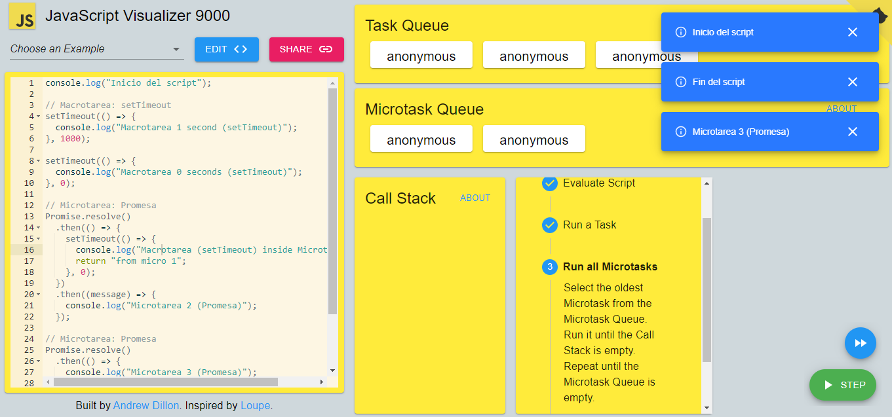

UNA MICROTAREA PASA A LA CALLSTACK


SE RESUELVE LA MICROTAREA 2 (PROMESA)


SE ELIMINA UNA MICROTAREA DE LA CALL STACK
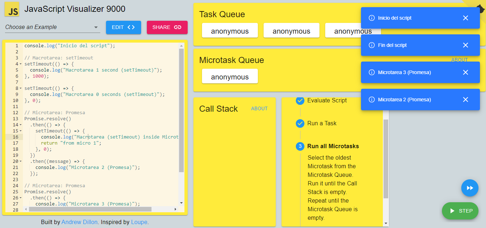

UNA MICROTAREA PASA A LA CALL STACK


SE EJECUTA LA MICROTAREA 4 (PROMESA)
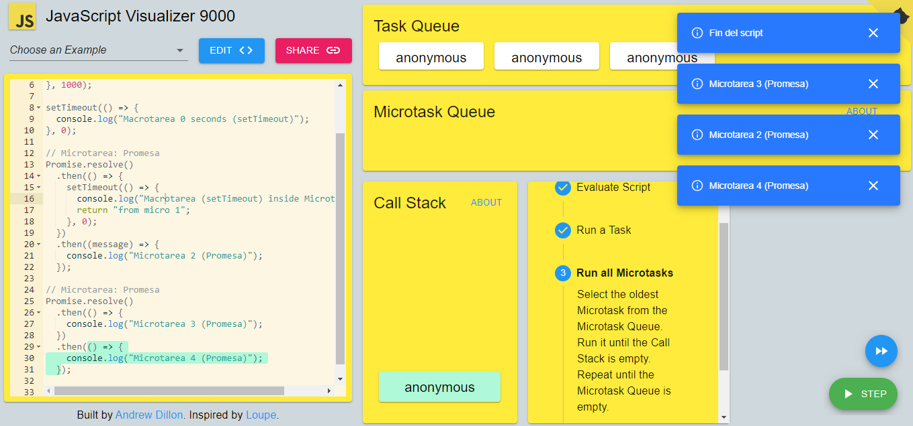

SE ELIMINA UNA MICROTAREA DE LA COLA DE LLAMADAS
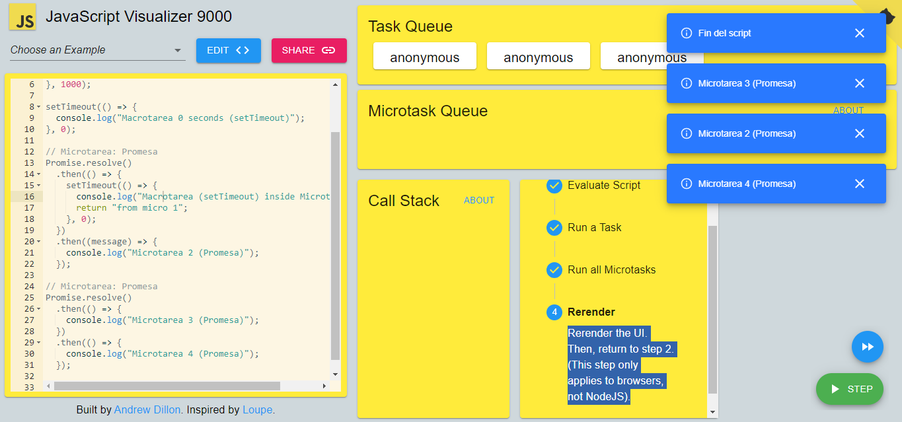

verifica si hay no hay microtareas

UNA MACROTAREA PASA LA PILA DE LLAMADAS


MACROTAREA 0 SECONDS (setTimeout) se ejecuta y se elimina de la call stack
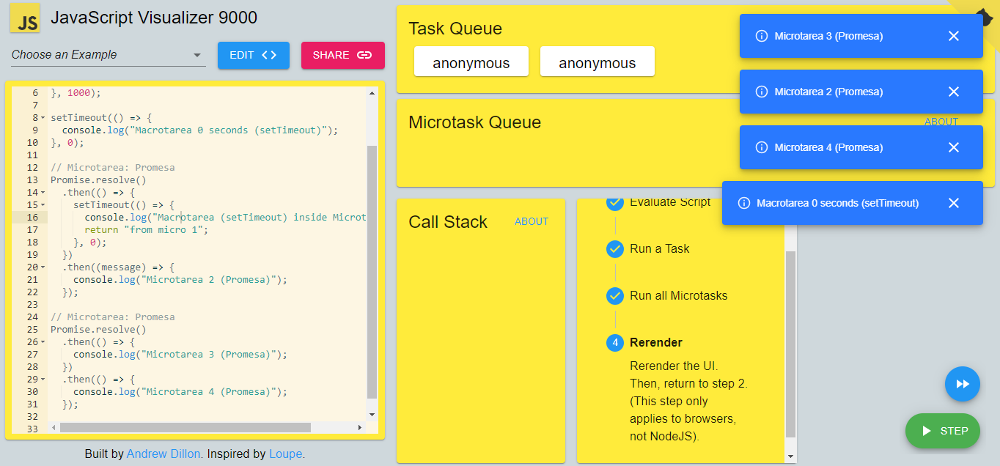

verifica si no hay microtareas

UNA MACROTAREA A LA CALL STACK


SE EJECUTA Y SE ELIMINA DE LA CALL STACK LA MACROTAREA(setTimeout) inside microtarea 1
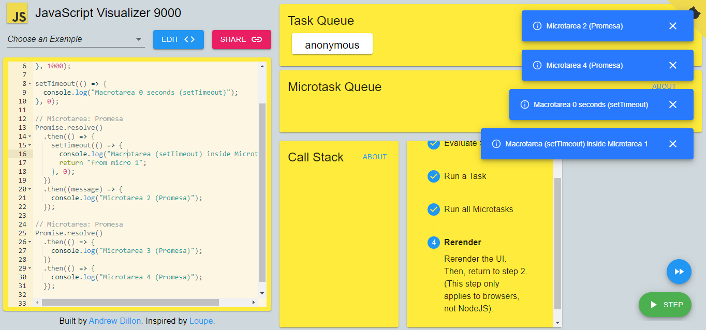

verifica si no hay microtareas

UNA MACROTAREA PASA A LA CALL STACK
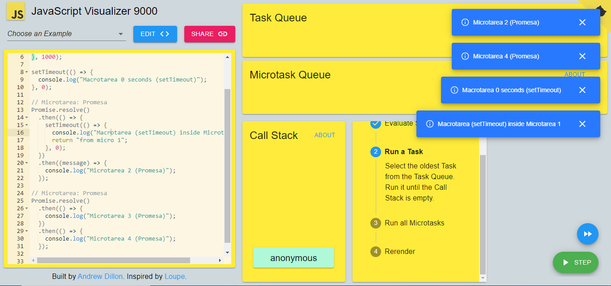

SE EJECUTA Y SE ELIMINA DE LA CALL STACK MACROTAREA 1 SECOND (setTimeout)


### Seccion 5: Aplicando Todos los Conceptos - Proyecto de Sistema de Reservas de Hotel

**Objetivo:** Desarrollar un sistema de reservas de hotel que permita a los usuarios reservar habitaciones, verificar disponibilidad, ver sus reservas actuales y cancelar reservas. Este sistema integrará los conceptos de scope, hoisting, closures, funciones declaradas y expresadas, asincronía, promesas, callbacks, y operaciones con Web APIs.

#### Requisitos del Sistema

- **Inicialización y Gestión de Datos:** Cargar data.json para almacenar y gestionar datos de habitaciones y reservas.

  - **Habitaciones:** Cada habitación debe tener un número único, un tipoHabitacionId , un precio por noche y una disponibilidad.
  - **Tipos de Habitaciones:** Cada tipo de habitación debe tener un tipoId, un nombre (individual, doble, suite) una descripción y una capacidad.
  - **Reservas:** Cada reserva debe tener un número único, el número de habitación reservada, la fecha de inicio y fin de la reserva, el nombre completo (nombre y apellido) del huésped en minúsculas y la cantidad de huéspedes.
  - **Carga de Datos:** Utilizar fetch para cargar los datos del archivo data.json que se encuentra junto a este README.md y almacenarlos en variables.

  - **Solucion Propuesta\***:
    - Usar arrays de objetos para almacenar habitaciones y reservas; objetos para modelar detalles de cada habitación y reserva. Esto permitirá manipular fácilmente los datos mediante métodos de array como find(), filter(), push(), y map().
    - Considera utilizar el siguiente script de ejemplo para cargar los datos de data.json en un tu archivo principal main.js o app.js:

```javascript
// Ruta del archivo data.json
const url = "data.json"; // Cambiar por la ruta correcta

// Función para cargar y mostrar el contenido de data.json
function cargarYMostrarData() {
  // Retorna una nueva promesa que se resuelve después del setTimeout
  return new Promise((resolve, reject) => {
    setTimeout(() => {
      // Realiza la solicitud fetch dentro del setTimeout
      fetch(url)
        .then((response) => {
          if (!response.ok) {
            throw new Error("Error al cargar los datos.");
          }
          return response.json();
        })
        .then((data) => {
          console.log("Habitaciones:", data.rooms);
          console.log("Tipos de Habitaciones:", data.roomTypes);
          resolve(data); // Resuelve la promesa con los datos cargados
        })
        .catch((error) => {
          console.error(error);
          reject(error); // Rechaza la promesa si hay un error
        });
    }, 3000);
  });
}

// Llamar a la función para cargar y mostrar el contenido de data.json
cargarYMostrarData()
  .then(({ rooms, roomTypes }) => {
    // Mostrar el contenido de las habitaciones después de cargar los datos

    // ... Continuar con la lógica de la app
    while (true) {
      const userInput = prompt(
        "Ingresa la opcion que deseas 1. Reservar 2. Ver Reservas 3. Cancelar Reserva 4. Salir"
      );
      switch (userInput) {
        case "1":
          const userInput2 = prompt(
            "Ingrese el numero de habitacion a reservar: " +
              rooms
                .map((room) => {
                  return `\nRoom Number: ${room.number} (${
                    roomTypes.find((type) => type.id === room.roomTypeId).name
                  })`;
                })
                .join(", ")
          );
          break;
        case "2":
          // Lógica para ver reservas actuales
          break;
        case "3":
          // Lógica para cancelar reservas
          break;
        case "4":
          // Salir del programa
          return;
        default:
          console.log("Opción inválida. Inténtalo de nuevo.");
      }
    }
  })
  .catch((error) => {
    console.error("Error al manejar la promesa:", error);
  });
```

Tener en cuenta que el script anterior es solo un ejemplo y deberá ser adaptado y extendido para cumplir con los requisitos del sistema de reserva, te preguntaras, ¿Por qué se utiliza una función para cargar y mostrar los datos en lugar de hacerlo directamente en el script? La respuesta es que la carga de datos es una operación asíncrona y fetch devuelve una promesa, por lo que es necesario manejar la promesa y los datos cargados en una función separada. En este caso setTimeout() se utiliza para simular una operación asíncrona y mostrar cómo se manejan las promesas en un entorno asíncrono. Además, se utiliza destructuring para extraer las propiedades rooms y roomTypes de los datos cargados desde los parametros de la promesa.

- **Registro de Reservas:** Permitir a los usuarios reservar habitaciones.

  - **Verificación de Disponibilidad:** Cuando un usuario desee reservar una habitación, el sistema primero preguntará cuántas personas se alojarán. Luego, mostrará las habitaciones disponibles que satisfagan tanto la capacidad requerida como la disponibilidad.
  - **Reserva Exitosa:** Una vez que el usuario elija una habitación, el sistema registrará la reserva y mostrará un mensaje de confirmación.

  - **Solucion Propuesta\***: Implementar una función crearReserva() que acepte detalles de la reserva, verifique la disponibilidad y almacene la reserva si la habitación está disponible. Utilizar closures para asignar un ID único a cada reserva mediante un generador de ID.

Ejemplo de Codigo para Generador de ID dentro de la Funcion crearReserva():

```javascript
function crearReserva(numeroHabitacion, fechaInicio, fechaFin, huesped) {
  function generarGeneradorId() {
    let id = 1; // Variable id se inicializa fuera de la función interna

    return function () {
      return id++; // Cada vez que se llama a la función, se incrementa id y se devuelve
    };
  }

  const generarId = generarGeneradorId(); // Se obtiene la función interna generarId()

  // Pruebas
  console.log(generarId()); // 1
  console.log(generarId()); // 2
  console.log(generarId()); // 3
  console.log(generarId()); // 4
  console.log(generarId()); // 5
}
```

- **Validacion de Disponibilidad:** Verificar la disponibilidad de una habitación antes de confirmar la reserva.

  - **Verificación de Capacidad:** Asegurarse de que la habitación tenga suficiente capacidad para el número de personas que se alojarán.
  - **Verificacion de disponibilidad:** Comprobar si la habitación está disponible.

  - **Solucion Propuesta\***: Simular una operación asíncrona con setTimeout() y promesas para replicar la verificación de disponibilidad, resolviendo la promesa si la habitación está disponible y rechazándola si no.

- **Ver Reservas Actuales:** Permitir a los usuarios ver sus reservas actuales.

  - **Filtrado de Reservas:** Mostrar solo las reservas que coincidan con el nombre completo del huésped.
  - **Visualización de Detalles:** Mostrar detalles de cada reserva, incluido el número de habitación, tipo de habitacion, la fecha de inicio y fin, y el estado de la reserva.

  - **Solucion Propuesta\***: Implementar una función verReservas() que acepte el nombre completo del huésped y filtre las reservas que coincidan con el nombre. Mostrar los detalles de cada reserva utilizando un bucle for o forEach().

- **Cancelar Reservas:** Permitir a los usuarios cancelar sus reservas actuales.

  - **Visualización de Reservas:** Mostrar las reservas actuales del usuario antes de cancelar.
  - **Identificación de Reserva:** Solicitar al usuario el número de reserva que desea cancelar.
  - **Confirmación de Cancelación:** Mostrar un mensaje de confirmación después de cancelar la reserva.

  - **Solucion Propuesta\***: Implementar una función cancelarReserva() que busque la reserva por ID y la elimine del array de reservas utilizando splice() o un método similar. Mostrar un mensaje de confirmación después de la cancelación.

- **Editar Reservas:** Permitir a los usuarios editar sus reservas actuales.

  - **Visualización de Reservas:** Mostrar las reservas actuales del usuario antes de editar.
  - **Identificación de Reserva:** Solicitar al usuario el número de reserva que desea editar.
  - **Edición de Reserva:** Permitir al usuario cambiar la fecha de inicio y fin de la reserva.

  - **Solucion Propuesta\***: Implementar una función editarReserva() que busque la reserva por ID y permita al usuario cambiar las fechas de inicio y fin. Actualizar la reserva en el array de reservas con los nuevos detalles.

```javascript
function constructora(name) {
  this.name = name;

  this.myMethod = function () {
    console.log(this.name);
  };
}
```